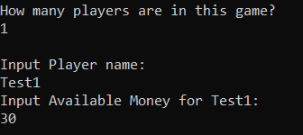
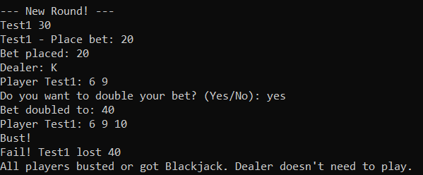
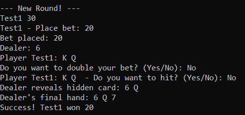
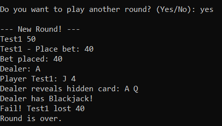

# Java Terminal Blackjack 


A fully-featured, Object-Oriented Blackjack (21) casino game played directly in your terminal. This project simulates a real casino table environment, complete with budget management, authentic dealer rules, and advanced player mechanics like splitting and doubling down.

---

## Features

* **Multiplayer Support:** Play with multiple friends at the same table.
* **Budget Management:** Players start with a set amount of money and place bets each round. Watch your wallet grow (or shrink)!
* **Advanced Mechanics:**
  * **Double Down:** Double your initial bet in exchange for committing to stand after receiving exactly one more card.
  * **Split:** If dealt a pair, split them into two separate hands and play them independently.
* **Authentic Dealer:** The dealer follows standard casino rules, hitting until they reach 17.
* **Continuous Play:** The deck is automatically managed and shuffled when cards run low. Play round after round until you decide to cash out or go broke!
* **Input Protection:** Error handling ensures the game won't crash if a player types the wrong command.

---

## Project Architecture

This project was built with a strong focus on **Object-Oriented Programming (OOP)** principles. The game flow is divided into several distinct, highly-cohesive classes:

* `Blackjack` - The main entry point that initializes the game.
* `BlackjackTable` - Manages the overarching game loop, player roster, and table limits.
* `Round` - Handles the strict step-by-step flow of a single game round.
* `Dealer` - Manages the dealer's hand, drawing rules, and settling bets.
* `Player` - Represents the player's active state in a round, managing bets and decisions (Hit, Stand, Double, Split).
* `CasinoCustomer` - Tracks the permanent state of a player across multiple rounds (Name, Total Money).
* `Hand` - Calculates scores dynamically (handling soft/hard Aces) and checks for Blackjack or Busts.
* `River` - Acts as the "shoe," managing multiple decks of cards, dealing, and shuffling.
* `Card` - Represents a single playing card and its integer value.

---

## Getting Started

### Prerequisites
You will need the Java Development Kit (JDK) installed on your machine to compile and run this program.
In order to run the program, you will need to compile all the java files and then run the game using ` java Blackjack ` .

### Installation & Execution

1. **Clone the repository:**
   ```bash
   git clone https://github.com/L1l1anCh/Blackjack-Java.git
   cd Blackjack-Java
   ```
### How to Play
1. When prompted, enter the number of players.
2. Enter the Name and Starting Budget for each player.



3. At the start of a round, each player places their bet.



4. The dealer will distribute two cards to everyone (one of the dealer's cards remains hidden).
5. On your turn, you will be prompted to make decisions:
- **Hit (Yes/No):** Draw another card to get closer to 21.
- **Double (Yes/No):** If you have the funds, double your bet and draw exactly one more card.
- **Split (Yes/No):** If you have a pair and the funds, split your hand into two.



6. Get closer to 21 than the dealer without going over (Busting) to win your bet!



7. Choose whether to continue to a new round or end the game.


